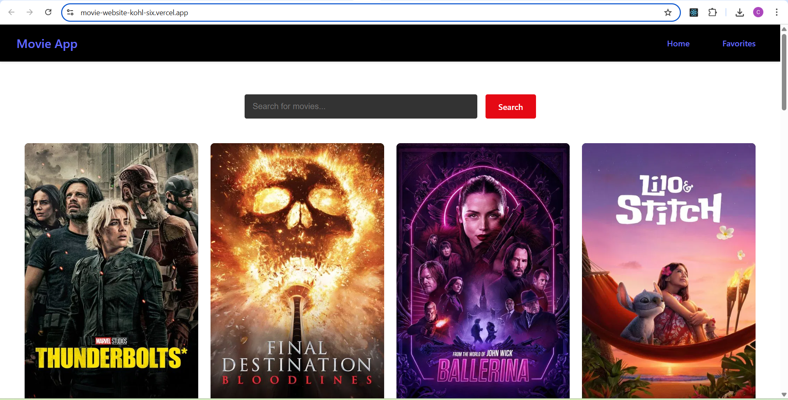
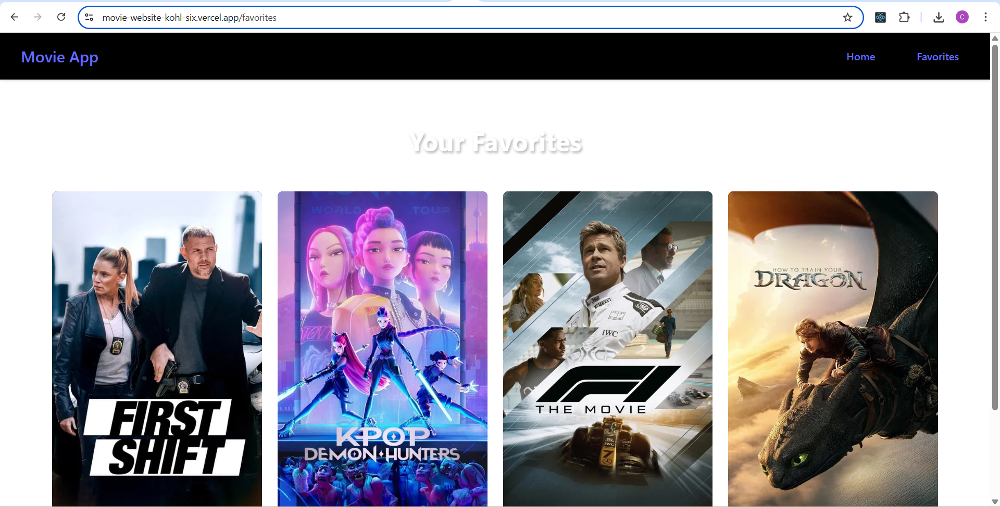

# 🎬 Movie App

A sleek and fully responsive **Movie Website** built using **React + Vite** that allows users to:

- 🔍 Search for any movie using the **TMDb API**
- ❤️ Mark movies as **Favorites**
- 🎞 View favorites in a separate **Favorites Page**
- ✨ Enjoy an attractive UI designed using **Bootstrap, CSS, and HTML**
- 🧩 Explore a modular and component-driven architecture using **React**

---

## 🚀 Features

- **Live Search**: Fetch real-time results from TMDb based on user input.
- **Favorites System**: Like a movie and view it later in a dedicated favorites page.
- **Responsive Design**: Looks great on desktop, tablet, and mobile.
- **Smooth UI**: Styled with Bootstrap and custom CSS for a clean and modern look.
- **Component-Based**: All views and logic split into reusable React components.
- **High Performance**: Built using **Vite** for ultra-fast development and optimized builds.

---

## 🛠️ Built With

- **React** – Frontend framework
- **Vite** – Fast build tool
- **Bootstrap** – UI framework
- **CSS / HTML** – Styling and structure
- **JavaScript (ES6+)** – Logic and interactivity
- **TMDb API** – Movie data and images

---

---

